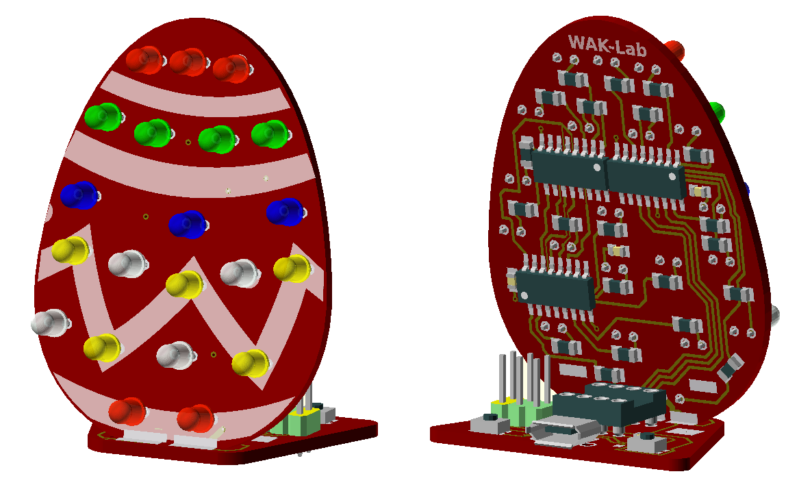
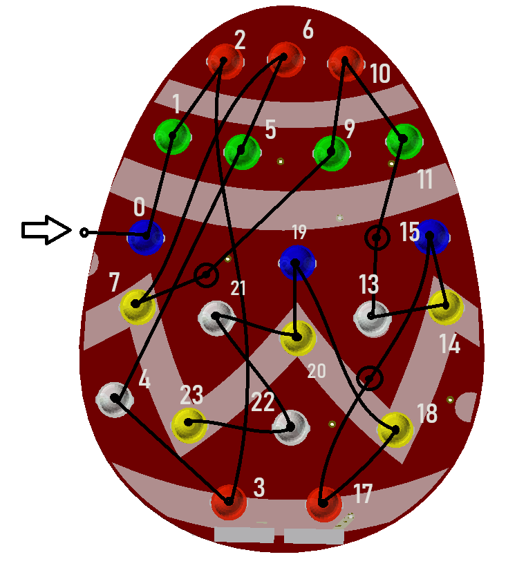

# LedEgg

WAK-Lab project 
* Atiny 25/45/85 based
* 3 74HC595D 8-bit serial-in, serial or parallel-out shift register with output latches
* 21 LEDs

## Led chain
3 positions are not connectet to a led but take a place in the serial stream of 3 bytes

## Input buttons
S1 - right (from behind) - RESET (PB5)
S2 - left  (from behind) - INPUT (PB4)
  * Use the INPUT_PULLUP because no external pullup installed
  * High - Not presses, Low - Key pressed  
  
## Programming
  Use an exterenal Programmer or Arduino as ISP,
  Pin 1 is close to te Attiny25
  
  MISO  - (1) o o (2) - 5V
  CLOCK - (3) o o (4) - MOSI
  RESET - (5) o o (6) - GND  
  
  
  Example Pinout Arduino Nano as ISP

    Arduino Pin 13 ---> SCK   (3)
    Arduino Pin 12 ---> MISO  (1)
    Arduino Pin 11 ---> MOSI  (4)
    Arduino Pin 10 ---> RESET (5)
    Arduino 5V     ---> VCC   (2)
    Arduino Ground ---> GND   (6)
    
  Dont´t forget to connect the 10 μF Capacitor to the Ground and Reset Pins on the 
  Arduino Nano programmer to prevent a reset of the programmer
