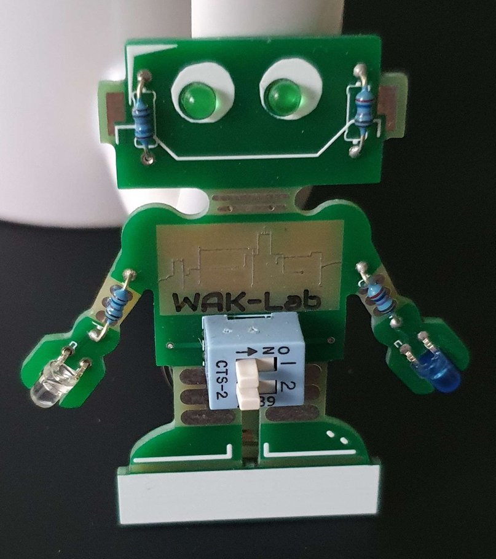
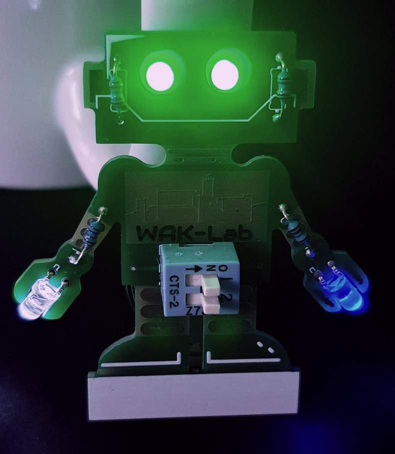

# SolderingKits

## Little Robot
EN: Small soldering exercise for the simple circuit with 4 LEDs, 2 switches 4 resistors and a button cell CR2032

DE: Kleine Lötübung für den einfachen Stromkreis mit  4 LEDs , 2 Schalter 4 Widerstände und eine Knopfzelle CR2032

Design: Martin Hildebrandt
licensed CC BY

Logo: By Dorothea Wendt
licensed CC BY-ND
