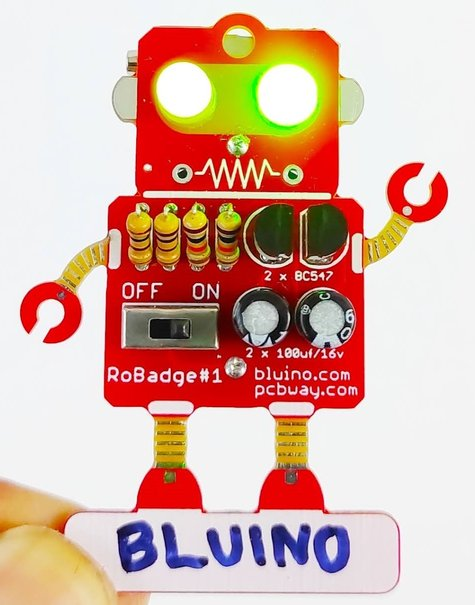

# SolderingKits

## Little Robot
EN: Small soldering exercise for the simple circuit with 4 LEDs, 2 switches 4 resistors and a button cell CR2032

DE: Kleine Lötübung für den einfachen Stromkreis mit  4 LEDs , 2 Schalter 4 Widerstände und eine Knopfzelle CR2032

[Detail](LittleRobot/Readme.md) 

Design: Martin Hildebrandt
licensed CC BY

Logo: By Dorothea Wendt
licensed CC BY-ND

## RoBadge#1

[Detail](RoBadge#1/Readme.md) 

## LedEgg

Design: Martin Hildebrandt
licensed CC BY

[Detail](LedEgg/README.md) 
